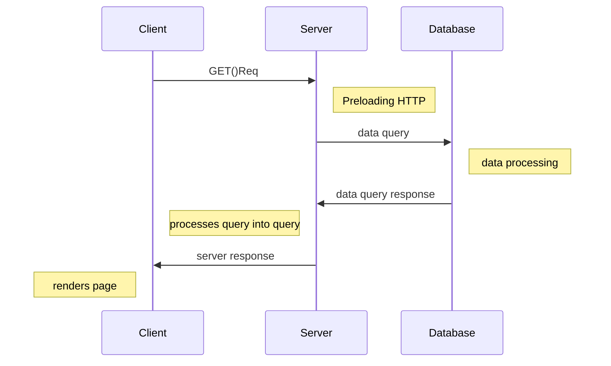

```mermaid

sequenceDiagram

participant Client
participant Server
participant Database

Client->>Server: GET()Req
Note right of Server: Preloading HTTP
Server->>Database: data query

Note right of Database: data processing

Database->>Server: data query response

Note left of Server: processes query into query

Server->>Client: server response

Note left of Client: renders page
```
