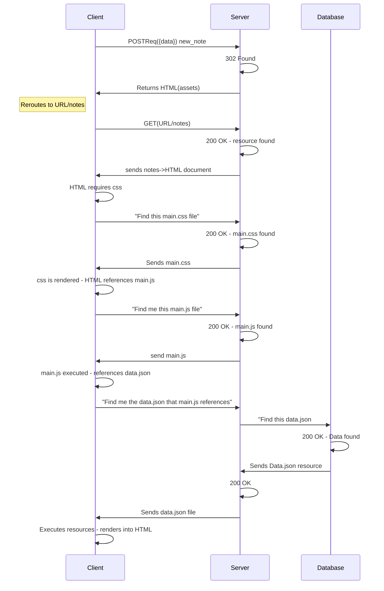

# My Chart for Exercise 1

```mermaid
    sequenceDiagram
    participant Client
    participant Server
    participant Database

  Client->>Server: POSTReq({data}) new_note
  Server->>Server: 302 Found
  Server->>Client: Returns  HTML(assets)
  Note left of Client: Reroutes to URL/notes
  Client->>Server: GET(URL/notes)
  Server->>Server: 200 OK - resource found
  Server->>Client: sends notes->HTML document
  Client->>Client: HTML requires css
  Client->>Server: "Find this main.css file"
  Server->>Server: 200 OK - main.css found
  Server->>Client: Sends main.css
  Client->>Client: css is rendered - HTML references main.js
  Client->>Server: "Find me this main.js file"
  Server->>Server: 200 OK - main.js found
  Server->>Client: send main.js
  Client->>Client: main.js executed - references data.json
  Client->>Server: "Find me the data.json that main.js references"
  Server->>Database: "Find this data.json
  Database->>Database: 200 OK - Data found
  Database->>Server: Sends Data.json resource
  Server->>Server: 200 OK
  Server->>Client: Sends data.json file
  Client->>Client: Executes resources - renders into HTML
```
